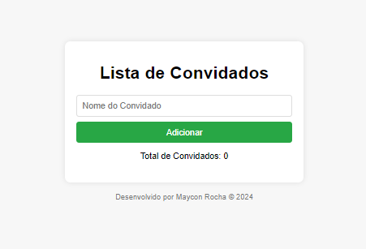

# Lista de Convidados para Aniversário

Este é um projeto simples de uma aplicação web para gerenciar a lista de convidados para um aniversário. A aplicação permite adicionar, editar e remover convidados, além de salvar os dados no `localStorage` para persistência. A interface é responsiva e adequada para visualização em dispositivos móveis.

## Funcionalidades

- Adicionar novos convidados.
- Remover convidados existentes.
- Editar nomes de convidados.
- Impedir a adição de nomes duplicados.
- Exibir uma mensagem de erro ao tentar adicionar um nome duplicado.
- Contador que mostra o total de convidados.
- Persistência de dados usando `localStorage`.

## Tecnologias Utilizadas

- HTML
- CSS
- JavaScript

## Estrutura do Projeto

 - index.html
 - styles.css
 - scripts.js
 - README.md

 

